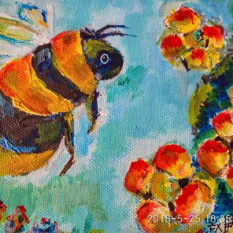

Page 1. Hypertext
=================

Hyperlink
---------

Let's do this:

`Visit the root website <https://jinghuazhao.github.io>`_

Logo Image
----------

This section displays the logo image:

code
----

There are more options:

.. code-block:: python
   :emphasize-lines: 3,5

   def some_function():
       interesting = False
       print('This line is highlighted.')
       print('This one is not...')
       print('...but this one is.')

csv table
---------

This is really cool!

.. csv-table:: Frozen Delights!
   :header: "Treat", "Quantity", "Description"
   :widths: 15, 10, 30

   "Albatross", 2.99, "On a stick!"
   "Crunchy Frog", 1.49, "If we took the bones out,
   it wouldn't be crunchy, now would it?"
   "Gannet Ripple", 1.99, "On a stick!"

Numbered List
-------------

Here are some sample steps:

1. Visit the website linked above.
2. View the logo image.
3. Read the rest of the documentation.
4. Share your feedback.

This concludes page...
